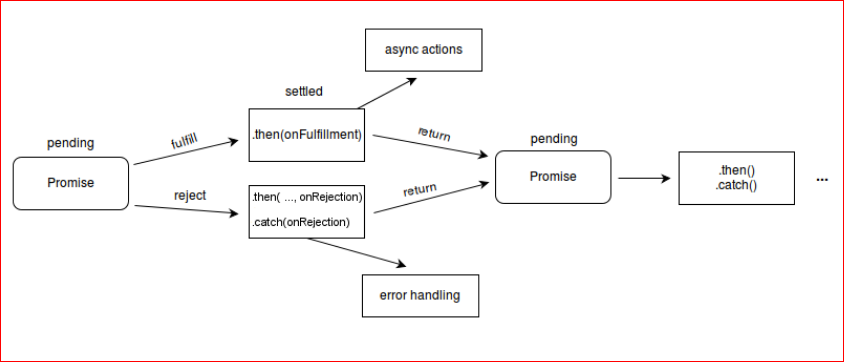

[**HOME**](../index.md)

# Promise - then - await - async - fetch

 
**new Promise**

     var promise1 = new Promise(function(resolve, reject) {
      setTimeout(function() {
        resolve('foo');
      }, 300);
    });

    promise1.then(function(value) {
      console.log(value);
      // expected output: "foo"
    });

    console.log(promise1);
    // expected output: [object Promise]
     
     
     
     
     
**await Permission**      

        _getLocationAsync = async () => {
           let { status } = await Permissions.askAsync(Permissions.LOCATION);
           if (status !== 'granted') {
             this.setState({
               errorMessage: 'Permission to access location was denied',
             });
           }

**await and async**

     function resolveAfter2Seconds(x) { 
       return new Promise(resolve => {
         setTimeout(() => {
           resolve(x);
         }, 2000);
       });
     }

     async function f1() {
       var x = await resolveAfter2Seconds(10);
       console.log(x); // 10
     }
     f1();
  
  
  **fetch**
  
     function fetchUser() {
         fetch(urlString + id.value)
             .then(res => res.json())
             .then(data => { data.name })
             };
               
             
     
