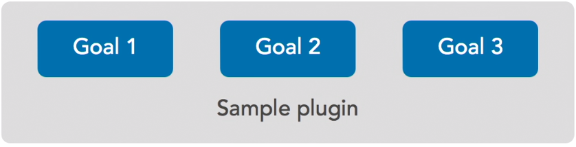

[**HOME**](index.md)

* A plugin is a collection of one or more goals.
* A goal is a "unit of work" in Maven (You find the goals for each plugin in the link "Complete List of Plugins on Apache Maven Site")

## Maven consist of several core plugins:
* JAR plugin (which creates the JAR, or Java Archive files.)
* Compiler Plugin (which contains goals for compiling source code and unit tests.)
* Surefire plugin ( which is used for executing unit tests and generating reports.)
* Create custom plugins (A custom plugin can be written in Java, or a plugin can be written in any number of languages, including Ant, Groovy, Bean, Ciao or Ruby.)
* <a href="https://maven.apache.org/plugins/index.html" target="_blank">**Complete List of Plugins on Apache Maven Site**</a>

___

* **documentation-plugin**

* <a href="https://docs.google.com/document/d/1C7_n6UIj_yp6HwWsPGRsn08sP0-iuXQR8fbazT2DZ68/edit?usp=sharing" target="_blank">**Plugin**</a>

* **maven-surefire-plugin**

* <a href="https://docs.google.com/document/d/13o2L2d8pNr58tfD1meQYaGVHxD8ESdjsQUrud-hEQiI/edit?usp=sharing" target="_blank">**Plugin**</a>

___

* **maven-failsafe-plugin**

* <a href="https://docs.google.com/document/d/13o2L2d8pNr58tfD1meQYaGVHxD8ESdjsQUrud-hEQiI/edit?usp=sharing" target="_blank">**Plugin**</a>

___

* **Embeded Maven test Plugin**

* <a href="https://docs.google.com/document/d/12D4fs3q6UOfZK1G4ytP6xeKelMpN_pl5STLsOdUYfHg/edit?usp=sharing" target="_blank">**Plugin**</a>

___

* **Plugin for Netbeans or Remote Tomcat Server**

* <a href="https://docs.google.com/document/d/1T4P2xCNQD544kS2F_o5zuxr2s9UlJa2r3T4RjIjTxWE/edit?usp=sharing" target="_blank">**Plugin**</a>

