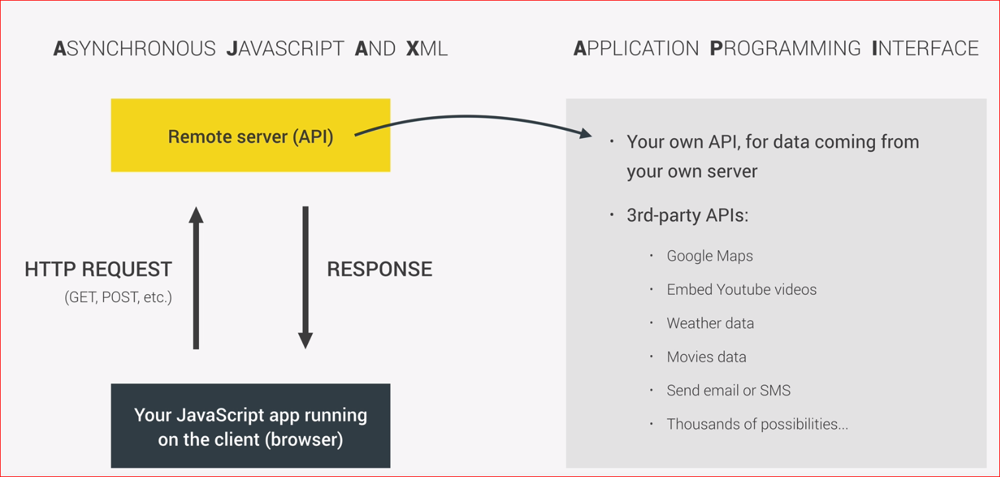

[**HOME**](../index.md)

# Promise - then - await - async - fetch

 
**new Promise**

        const getNewProm = new promise((resolve, reject) => {
          setTimeout( () =>
          resolve([453, 852, 951, 746])
          },1500);
        });

       getIDs
        .then( (IDs) => {console.log(IDs)}) 
        .catch( (error) => {console.log(error);
        });
      
      
**await Permission**      

        _getLocationAsync = async () => {
           let { status } = await Permissions.askAsync(Permissions.LOCATION);
           if (status !== 'granted') {
             this.setState({
               errorMessage: 'Permission to access location was denied',
             });
           }

**await and async**

       async function getRecipesAW() {
              const IDs = await getIDs;
              console.log(IDs);
              const recipe = await getRecipe(IDs[2]);
              console.log(recipe);
              const related = await getRelated('Jonas Schmedtmann');
              console.log(related);

              return recipe;
          }
       
       getRecipesAW().then(result => console.log(`${result} is the best ever!`));
  
  
  **fetch**
  
      function getWeather(woeid) {
                fetch(`https://crossorigin.me/https://www.metaweather.com/api/location/${woeid}/`)
                .then(result => {
                    // console.log(result);
                    return result.json();
                })
                .then(data => {
                    // console.log(data);
                    const today = data.consolidated_weather[0];
                    console.log(`Temperatures today in ${data.title} stay between ${today.min_temp} and ${today.max_temp}.`);
                })
                .catch(error => console.log(error));
            }
            getWeather(2487956);
            getWeather(44418);
