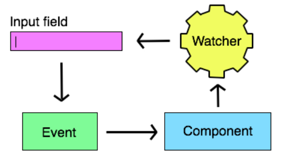

[**REACT**](react.md)

## Handling Events

* React events are named using camelCase, rather than lowercase.
* With JSX you pass a function as the event handler, rather than a string.

In Html you would handle events like that:

      <button onclick="activateLasers()">
      Activate Lasers
    </button>
    
In React:

    <button onClick={activateLasers}>
      Activate Lasers
    </button>

* **In a Controlled Component React state is made the "Single source of truth", so how:**

     1. do we ensure that input controls like text, textarea or select always presents the value found in the components state?
     2. Do we ensure that a controls state, always matches the value found in an input control?

      
     _In React, mutable state(text,textare and select are mutable states) is typically kept in the state property(Eigenschaften) of              components, and only updated with setState(). An input what is controlled by React is called a "controlled component"._
      
    Basically, when you want to implement **'single source of truth'**, you want to make your components controllable. 
    
    By default input fields are not controllable, which means it will render data from DOM, not state. However, if you make your input listen to state instead (therefore making it controllable) it will not be able to change its value unless you change state. 
    
    First effect you will notice is that, once you added value property to it, when you type in, nothing will change. And if you add         onChange method that changes state, it will be fully controllable component that only listens to one source of truth; state,             instead of DOM events.
    
    This is also related to one way data binding. It means that there is only one place which represents state of application, and your UI listens to it. And listening UI will change only if data at this place is changed, never else.
    
    
    
    
    
* **What is the purpose of doing event.preventDefault() in an event handler?**

Calling preventDefault() during any stage of event flow cancels the event, meaning that any default action normally taken by the implementation as a result of the event will not occur.

You can use Event.cancelable to check if the event is cancelable. Calling preventDefault() for a non-cancelable event has no effect.

* **What would be the effect of NOT doing event.preventDefault in a submit handler?**

If we would take the example of a "form" what would normally redirect us to another url, but exactly that can we provent from happening if we use event.preventDefault. We preventing it from his "main purpose".

* **Why don't we want to submit the traditional way, in a single page application?**

We wont to make the users Input controllable. That means we want to be able to check or adjust the input we get from the user. 

* **What are the two different ways, we can use, to make this work as expected for our event handlers?**

     1. Add a changeHandler who can change the state and therefor has controll indstead of the DOM event.
     2. One Way Binding

    
    
    
    
    

